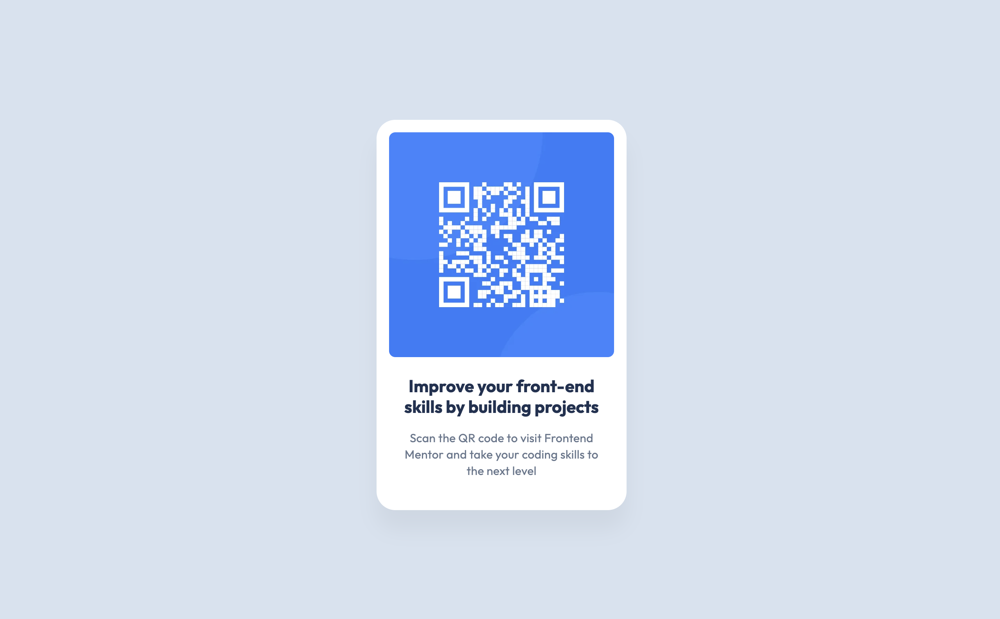

# Frontend Mentor - QR code component solution

## 目次

- [Overview](#overview)
  - [Screenshot](#screenshot)
  - [Links](#links)
- [My process](#my-process)
  - [Built with](#built-with)
  - [What I learned](#what-i-learned)
  - [Useful resources](#useful-resources)
- [Author](#author)

## Overview

### Screenshot

### Links

- Solution URL: [Here](https://www.frontendmentor.io/solutions/qr-code-component-TYlfisc4Jg)
- Live Site URL: [Here](https://fem-qrcode-component-project.netlify.app/)

## My process

### Built with

- Astro
- Tailwind CSS

### What I learned

Astroの基本的な使い方とTailwind CSSの導入方法について学ぶことができました。

### Useful resources

- [AstroにTailwind CSSを導入する](https://docs.astro.build/en/guides/styling/#tailwind) - Tailwind CSSの導入方法について学べました。
- [AstroのImageコンポーネント](https://docs.astro.build/ja/guides/images/) - Imageコンポーネントと画像をどこに配置した方が良いかについて学ぶことができました。

## Author

- Frontend Mentor - [@Rashsea3927](https://www.frontendmentor.io/profile/Rashsea3927)
